## 说明

请先查看[主分支](https://github.com/q809198545/node-sorry) 

以下是dev分支有不同的地方，附带个人部署CentOS遇到的问题与解决

此时笔者的个人背景
<ul>
<li>看得懂英文</li>
<li>看不懂会百度</li>
<li>Node.js知道是什么，ffmpeg不了解，Linux知道输入命令要按Enter</li>
<li>HTML、CSS、jQuery使用者，未接触过其他后台语言</li>
<li>本地为Windows10</li>
</ul>


## 文章目录：

<ol>
	<li>目录结构</li>
	<li>项目无关文件</li>
	<li>从0开始部署服务器：
		<ol>
			<li>服务器选择</li>
			<li>服务器创建</li>
			<li>登录</li>
			<li>项目运行
				<ul>
					<li>ffmpeg安装</li>
					<li>Node.js安装</li>
					<li>项目拷贝</li>
					<li>项目运行</li>
					<li>遇到的问题</li>
				</ul>
			</li>
		</ol>
	</li>
	<li>我看过的Node.js入门资料</li>
</ol>

## 目录结构

```
├─bin
│  │
│  └─www                     //是应用的主入口
│
├─controller                 // 后端Contoller
│  │  
│  └─render.js               // 核心代码，用ffmpeg生成gif图
│ 
├─node_modules               // 依赖
│
├─public                     // 静态资源
│  │
│  ├─cache                   //gif输出目录
│  │
│  ├─images                  //图片
│  │
│  ├─javascripts             //js
│  │
│  ├─stylesheets             //css样式
│  │
│  └─templates               //gif模板
│
├─routes                     // 路由目录
│  │
│  └─index.js                // 路由文件
│
├─views                      // 视图模板
│  │
│  ├─header.ejs              //公用部分 
│  │
│  ├─footer.ejs              //公用部分
│  │
│  ├─xxx.ejs                 // sorry等输入框部分的内容
│  │
│  └─404.ejs                 // 404页面
│
├─app.js                     // 主要配置文件
│
├─ffmpeg.exe                 // 方便window用户使用，linux请安装
│
└─pageage.json
   
   
```

## 项目无关文件

img文件夹：README.md 从0开始部署服务器所用图片


## 从0开始部署服务器

### 服务器选择
国内大厂阿里云的云服务器ECS、腾讯云的云服务器CVM；

国内小厂尚未了解，国外更多，不再介绍。

此处使用Vultr（支持支付宝）

百度Vultr即可，或者使用笔者的推广[链接](https://www.vultr.com/?ref=7229380)（读者创建服务器后，会送笔者10美金⊙▽⊙ ）

Vultr注册、登录、账户充值不再赘述。

### 服务器创建
注册完成后，在左边选择“Servers”标签，点击右边的加号部署新的服务器

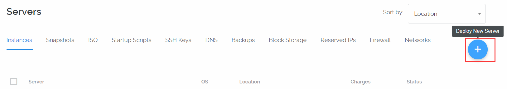

任选一个地点，当然靠近中国的亚洲地区延迟会低一些。即东京、新加坡

此处笔者选了New York。（因为它有2.5美元/月套餐）。套餐收费规则请自行百度

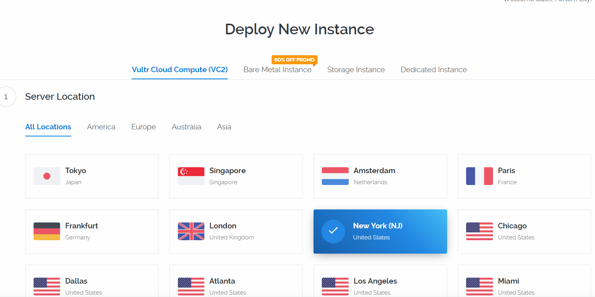
 
往后选择操作系统，笔者为CentOS 6 64位；

第三步选择硬件，各位按需

 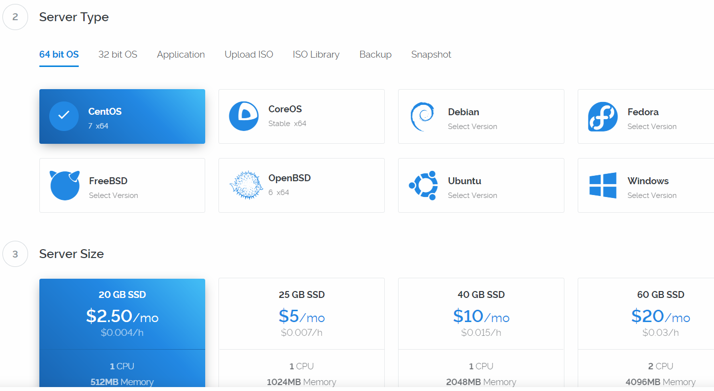
 
后面的参数跳过，笔者也不懂_(:з)∠)_只用默认的，点击Deploy Now。

 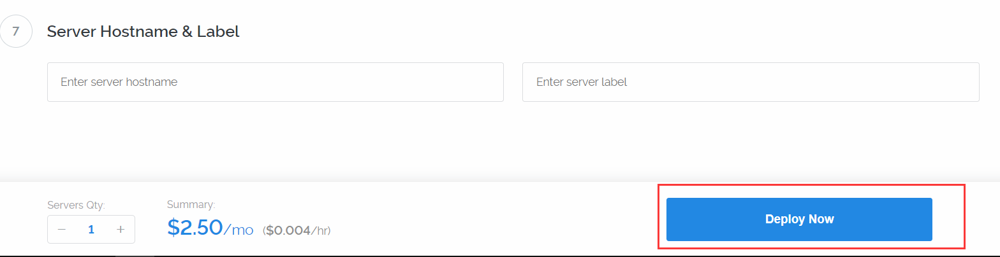
 
等待两三分钟，服务器即可安装完成。

 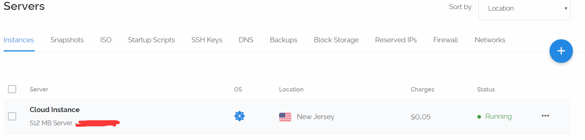
 
点击服务器名字（此处为Cloud Instance）进入概览

 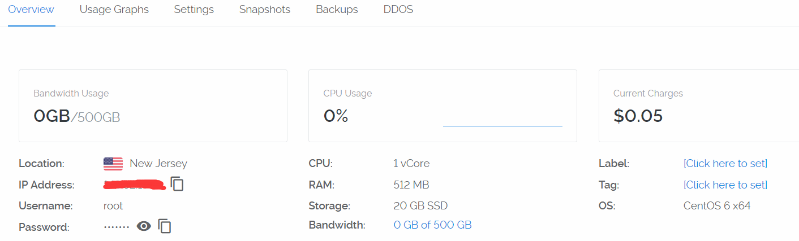
 
连接服务器进行操作，可以用软件，比如PuTTy，或者Vultr自带的控制台

 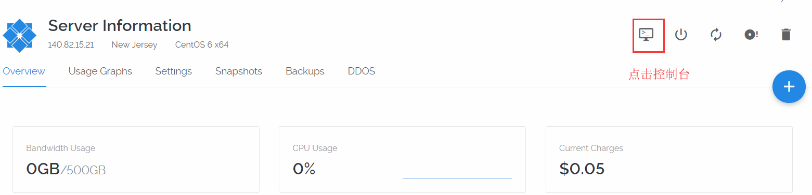 
 
### 登录

登录名输入为root，按Enter

登录密码，点击眼睛即可显示

 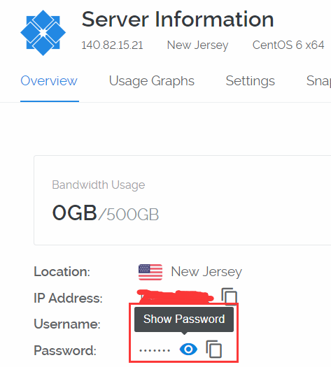
 
<strong>注：登录密码即使键盘输入也不会显示</strong>

登陆成功

  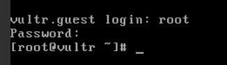
  
Vultr给的初始密码太过复杂，建议改个密码，敲入命令passwd

输入用户自己的密码（同样不会显示）

再度确认

 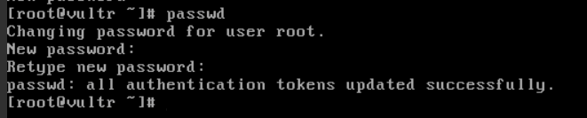
 
那么下次连接的时候就用新密码了。

接下来是项目运行，需要：
<ol>
<li>环境部署</li>
<li>项目拷贝到服务器</li>
<li>项目运行</li>
</ol>

如果遇到问题，可以往后翻笔者遇到过的坑。若还是不行，百度吧！

### 环境部署：在线生成动图涉及到ffmpeg和Node.js。

#### ffmpeg安装

命令行依次敲入：

```
wget https://ffmpeg.org/releases/ffmpeg-3.4.2.tar.bz2
yum -y install bzip2
yum -y install yasm
yum -y install libass libass-devel
tar -xf ffmpeg-3.4.2.tar.bz2
cd ffmpeg-3.4.2
./configure --enable-libass

make
make install
```

#### Node.js安装

```
curl --silent --location https://rpm.nodesource.com/setup_8.x | sudo bash -
yum -y install nodejs
```
输入node -v 命令可以查看版本号

### 项目拷贝

使用软件WinSCP。

文件协议请选择SFTP。

输入服务器IP，端口选22，输入用户名，点击登陆后会提示输入密码

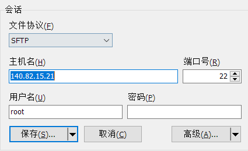

将电脑里的项目解压后直接拖入到root文件夹下面

### 项目运行

```
##进入文件夹
cd node-sorry
#安装项目需要的依赖
npm install
#启动项目
npm start
```
访问ip:3000，查看效果，比如笔者的demo：
140.82.15.21:3000


#### 笔者遇到的问题

####  1.gcc编译器
在输入./configure --enable-libass
提示没有安装gcc编译器
 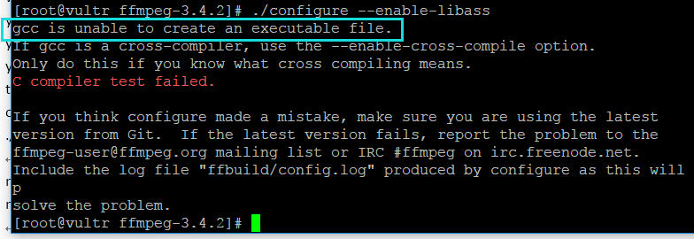
 
那么安装gcc
```
yum install gcc
```
它会先下载，再问你是否安装，当然输入y

 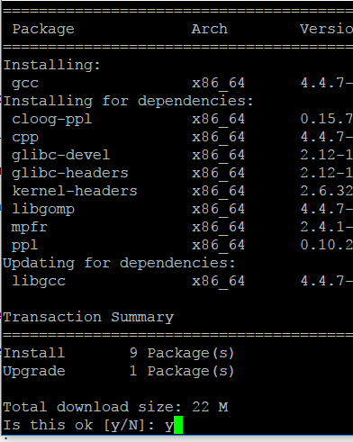
 
继续./configure --enable-libass

然后是make，make的时间比较长，大约要15分钟。

####  2.ip:3000拒绝访问
可能原因：

1.使用的是内网，在windows上ping ip查看

2.防火墙导致，临时关闭，输入命令
```
service iptables stop
```
####  3.关闭控制台后无法访问

关闭puTTY后进程中止，想要继续后台运行，可以参考[Express官方文档](http://www.expressjs.com.cn/advanced/pm.html)

####  4.字幕未渲染

CentOS缺少中文字体：
将本地系统的C:\Windows\Fonts选取字体，复制到/usr/share/fonts；
刷新内存中的字体缓存
```
fc-cache
```
参考文章[ Linux CentOS 7 安装字体库 & 中文字体](https://blog.csdn.net/wlwlwlwl015/article/details/51482065)
## 我看过的Node.js入门资料（0后台基础）：
<ul>
<li>书籍<a href="https://www.amazon.cn/dp/B00ALPRM3W/ref=sr_1_6?ie=UTF8&qid=1522147601&sr=8-6&keywords=nodejs" title="Node.js开发指南">Node.js开发指南</a> by 郭家宝(BYVoid)：只看前4章，后面使用express框架做项目已经过时，和现版本相差太大，不建议观看</li>
<li><a href="https://yunnysunny.gitbooks.io/nodebook/content/" title="台湾nodejs社区翻译">Node.js Wiki Book简体版</a></li>
<li><a href="https://yunnysunny.gitbooks.io/nodebook/content/" title="台湾nodejs社区翻译">《一起学 Node.js》</a>：用Node.js搭建博客</li>
</ul>
